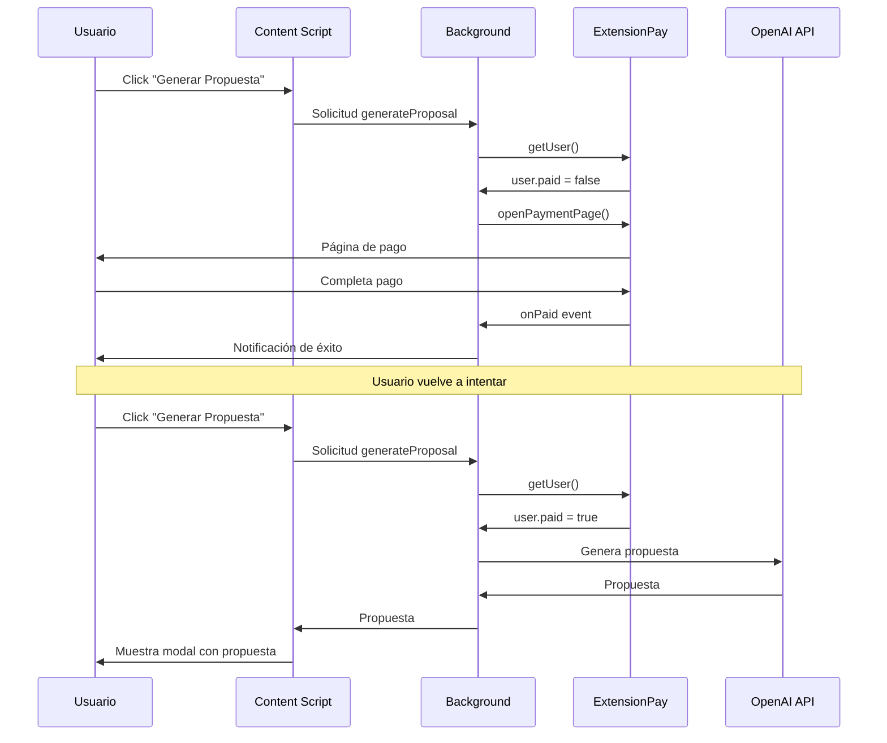

# AI Proposal Pro - Configuración de ExtensionPay

## 🔧 Configuración Necesaria

Para que el sistema de pagos funcione, necesitas:

### 1. Crear cuenta en ExtensionPay

1. Ve a [https://extensionpay.com/](https://extensionpay.com/)
2. Crea una cuenta gratuita
3. Registra tu extensión

### 2. Obtener tu Extension ID

Después de registrar tu extensión en ExtensionPay, obtendrás un **Extension ID** único.

### 3. Reemplazar el Extension ID en el código

Busca y reemplaza `'your-extension-id'` con tu ID real en estos archivos:

#### [background.js](file:///c:/Proyectos/Extension/background.js)
```javascript
const extpay = ExtPay('your-extension-id'); // Línea 10
```

#### [popup.js](file:///c:/Proyectos/Extension/popup.js)
```javascript
const extpay = ExtPay('your-extension-id'); // Línea 4
```

### 4. Configurar precio en ExtensionPay

En el dashboard de ExtensionPay:
- Define el precio de tu extensión (ej: $4.99)
- Configura el tipo de pago (único o suscripción)
- Personaliza la página de pago

## 📝 Estructura de Archivos

Los siguientes archivos han sido modificados para integrar ExtensionPay:

### Archivos Modificados

1. **[manifest.json](file:///c:/Proyectos/Extension/manifest.json)**
   - Añadido `https://extensionpay.com/*` a `host_permissions`
   - Añadido `web_accessible_resources` para iconos
   - Añadido permiso `notifications`

2. **[background.js](file:///c:/Proyectos/Extension/background.js)**
   - Inicialización de ExtensionPay
   - Función `checkPaymentAndGenerate()` que verifica pago antes de generar propuestas
   - Listener `onPaid` para cuando el usuario completa el pago
   - Abre página de pago al instalar la extensión

3. **[popup.js](file:///c:/Proyectos/Extension/popup.js)**
   - Inicialización de ExtensionPay
   - Función `checkPaymentStatus()` para verificar estado de pago
   - Función `updatePaymentUI()` para mostrar banner/badge según estado

4. **[popup.html](file:///c:/Proyectos/Extension/popup.html)**
   - Script de ExtensionPay cargado en el `<head>`

5. **[popup_styles.css](file:///c:/Proyectos/Extension/popup_styles.css)**
   - Estilos para `.payment-banner`
   - Estilos para `.premium-badge`

6. **[modal.js](file:///c:/Proyectos/Extension/modal.js)**
   - Manejo de respuesta `needsPayment`
   - Botón para abrir página de pago en modal de error

### Archivo Nuevo

7. **[extpay.html](file:///c:/Proyectos/Extension/extpay.html)**
   - Página HTML mínima para cargar ExtensionPay (requerido por Manifest V3)

## 🔄 Flujo de Funcionamiento



## 💡 Características Implementadas

### ✅ Verificación de Pago
- Cada vez que el usuario intenta generar una propuesta, se verifica su estado de pago
- Si no ha pagado, se abre automáticamente la página de pago
- Si ya pagó, la propuesta se genera normalmente

### ✅ UI Adaptativa
- **Usuarios gratuitos**: Banner amarillo con botón "Desbloquear Premium"
- **Usuarios premium**: Badge "✨ Premium" en el header

### ✅ Modal de Pago
- Si el usuario no ha pagado, el modal muestra un mensaje claro
- Botón "Desbloquear Ahora" para ir directamente al pago

### ✅ Notificación Post-Pago
- Cuando el usuario completa el pago, recibe una notificación del navegador
- Confirma que ya puede usar la extensión sin límites

## 🧪 Testing

Para probar el flujo:

1. **Sin pagar**:
   - Instala la extensión
   - Se abrirá automáticamente la página de pago
   - Intenta generar una propuesta → Debe pedir el pago

2. **Después de pagar**:
   - Completa el pago en ExtensionPay
   - Recarga la extensión
   - El badge "Premium" debe aparecer
   - Las propuestas deben generarse normalmente

## ⚠️ IMPORTANTE

> [!WARNING]
> No olvides reemplazar `'your-extension-id'` con tu Extension ID real antes de publicar la extensión.

> [!NOTE]
> ExtensionPay requiere que publiques la extensión en Chrome Web Store para funcionar en producción. En desarrollo, usa su modo de prueba.

## 📚 Recursos

- [Documentación de ExtensionPay](https://extensionpay.com/docs)
- [Dashboard de ExtensionPay](https://extensionpay.com/dashboard)
- [Guía de precios](https://extensionpay.com/pricing-guide)

---

**Sistema de pagos completamente integrado** ✅
